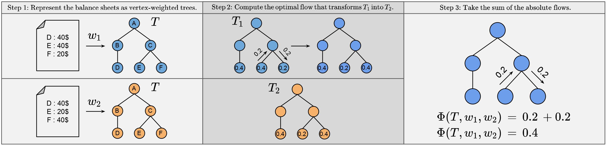

# An Earth Mover's Distance Based Graph Distance Metric For Financial Statements

This repository contains a Python implementation of the distance metric described in the paper: 
*An Earth Mover's Distance Based Graph Distance Metric For Financial Statements*

<!---
*Paper*: https://snoels.github.com/papers
-->

If you find the code useful, please consider citing this paper.
```bibtex
@unpublished{noels2021,
  author = {Noels, Sander},
  title = {An Earth Mover's Distance Based Graph Distance Metric For Financial Statements},
  note = {Manuscript submitted for publication},
  year = {2021}
}
```



<!-- TABLE OF CONTENTS -->
<details>
  <summary>Table of Contents</summary>
  <ol>
    <li>
      <a href="#about-the-project">About The Project</a>
      <ul>
        <li><a href="#built-with">Built With</a></li>
      </ul>
    </li>
    <li>
      <a href="#getting-started">Getting Started</a>
      <ul>
        <li><a href="#installation">Installation</a></li>
      </ul>
    </li>
    <li><a href="#dataset">Dataset</a></li>
    <li><a href="#contact">Contact</a></li>
  </ol>
</details>

## About The Project

Quantifying the similarity between a group of companies has proven to be useful for several purposes, including company benchmarking, fraud detection, and searching for investment opportunities. This exercise can be done using a variety of data sources, such as company activity data and financial data. However, ledger account data is widely available and is standardized to a large extent. Such ledger accounts within a financial statement can be represented by means of a tree, i.e. a special type of graph, representing both the values of the ledger accounts and the relationships between them. Given their broad availability and rich information content, financial statements form a prime data source based on which company similarities or distances could be computed.

We present a graph distance metric that enables one to compute the similarity between the financial statements of two companies. This method may be useful for investors looking for investment opportunities, government officials attempting to identify fraudulent companies, and accountants looking to benchmark a group of companies based on their financial statements.

<p align="right">(<a href="#top">back to top</a>)</p>

### Built With

The following frameworks/libraries were utilized to get this project started:
* [Python](https://www.python.org/)
* [PuLP](https://pypi.org/project/PuLP/)
* [NetworkX](https://networkx.org/)
* [Matplotlib](https://matplotlib.org/)
* [PyGraphviz](https://pygraphviz.github.io/)
* [Jupyter](https://jupyter.org/)

<p align="right">(<a href="#top">back to top</a>)</p>

## Getting Started

Instructions for setting up this project locally can be found here. Follow the simple installation steps to get your local up and running.

### Installation

1. Clone the repo
   ```sh
   git clone https://github.com/snoels/earth-movers-graph-distance-metric.git
   ```
2. Change your directory to the repo
   ```sh
   cd earth-movers-graph-distance-metric/
   ```
3. Create the conda environment `env-edm-gdm`
   ```sh
   conda env create -f environment.yml
   ```
4. Install pygraphviz (Ubuntu and Debian)
   ```sh
   sudo apt-get install graphviz graphviz-dev
   pip install pygraphviz==1.6
   ```
   
<p align="right">(<a href="#top">back to top</a>)</p>

## Dataset

Ten example vertex-weighted company representations can be found in the following file: `./synthetic_data/synthetic_company_graph_data.pkl`.

This data is synthetical data inspired on the vertex-weighted balance sheets representation of a balance sheet and by no means represents real company data.

<p align="right">(<a href="#top">back to top</a>)</p>

## Contact

This repository is currently maintained by me. You can reach me at sander.noels@ugent.be.

<!-- Actual text -->
You can find me on [![LinkedIn][1.2]][1].

<!-- Icons -->
[1.2]: https://raw.githubusercontent.com/MartinHeinz/MartinHeinz/master/linkedin-3-16.png

<!-- Links to your social media accounts -->
[1]: https://www.linkedin.com/in/sander-noels-79411815a/

<p align="right">(<a href="#top">back to top</a>)</p>
